# Pact for Splunk — Architecture

## Table of Contents

1. [System Overview](#1-system-overview)
2. [Layer Map](#2-layer-map)
3. [Pact Core Library](#3-pact-core-library)
   - [Class Diagram](#31-class-diagram)
   - [Execution & Tool Tracing](#32-execution--tool-tracing)
   - [Commitment](#33-commitment)
   - [Verification Pipeline](#34-verification-pipeline)
   - [Verifiers](#35-verifiers)
   - [Coverage Computation](#36-coverage-computation)
   - [Observer Interface](#37-observer-interface)
4. [Splunk Observer](#4-splunk-observer)
   - [HEC Transport](#41-hec-transport)
   - [SPL Auto-Generation](#42-spl-auto-generation)
   - [MCP Tools](#43-mcp-tools)
5. [OpsGuard Agent](#5-opsguard-agent)
   - [Agent Setup](#51-agent-setup)
   - [Tool Classification](#52-tool-classification)
   - [Simulated Environment](#53-simulated-environment)
   - [Scenario System](#54-scenario-system)
6. [FastAPI Backend](#6-fastapi-backend)
7. [Next.js Frontend](#7-nextjs-frontend)
8. [Data Flow — Happy Path](#8-data-flow--happy-path)
9. [Data Flow — Violation Demo](#9-data-flow--violation-demo)
10. [Type System](#10-type-system)
11. [Key Design Decisions](#11-key-design-decisions)

---

## 1. System Overview

Pact for Splunk is composed of four independent layers that communicate through clean interfaces:

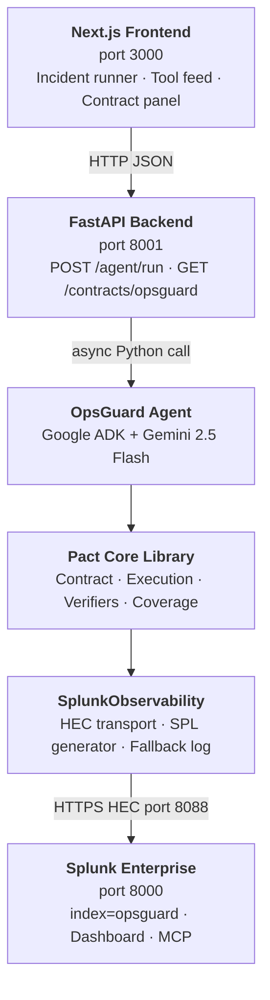

---

## 2. Layer Map

| Layer | Technology | Role |
|---|---|---|
| Frontend | Next.js 14, TypeScript, Tailwind | Incident runner, real-time tool feed, contract monitoring UI |
| Backend | FastAPI, Python 3.11, Pydantic | API gateway between frontend and agent |
| Agent | Google ADK, Gemini 2.5 Flash | Autonomous incident response; drives tool calls |
| Pact Library | Pure Python | Contract definition, tool tracing, verification, coverage |
| Splunk Observer | Python + requests | HEC delivery, SPL generation, fallback logging |
| Splunk | Splunk Enterprise | Event storage, dashboards, AI Assistant (MCP) |

---

## 3. Pact Core Library

### 3.1 Class Diagram

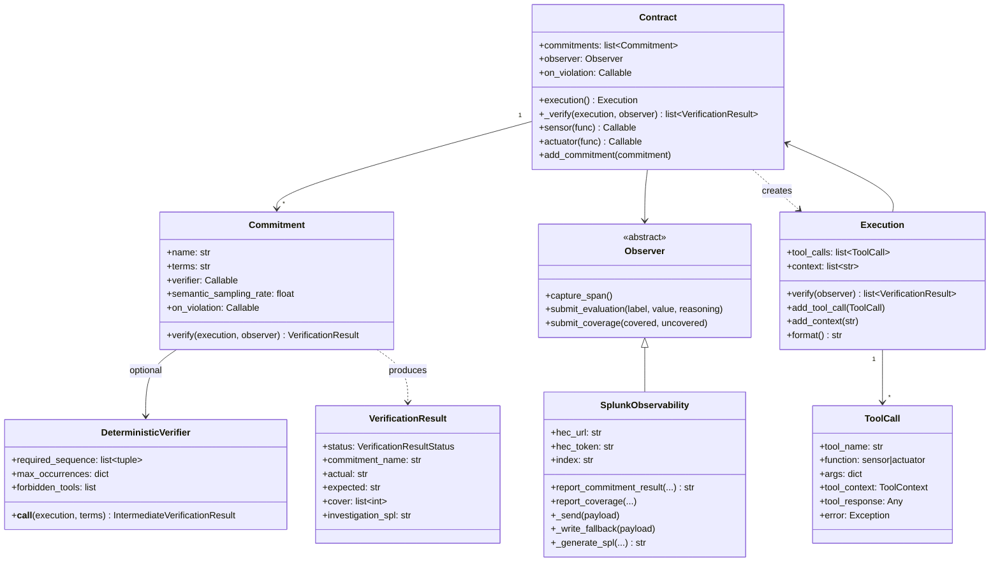

`Contract._verify()` is the core method. It:
1. Calls `commitment.verify(execution)` for every commitment
2. Fires `commitment.on_violation` or `contract.on_violation` on non-pass results
3. Computes coverage from the union of all `result.cover` index sets
4. Calls `observer.submit_coverage(covered, uncovered)`
5. Returns `list[VerificationResult]`

**`@contract.sensor` / `@contract.actuator`** are function decorators. Wrapping a function with either one makes every call during an active execution automatically append a `ToolCall` to `execution.tool_calls`. The distinction between `sensor` (read-only) and `actuator` (state-changing) is semantic — both are traced identically but the `function` field on `ToolCall` records the type.

### 3.2 Execution & Tool Tracing

`pact/execution.py` — represents a single agent run. Implements the context manager protocol.

```python
with contract.execution() as execution:
    # All @contract.sensor / @contract.actuator calls
    # inside this block append to execution.tool_calls
    run_agent()
    results = execution.verify()
```

**How tool tracing works without modifying the agent:**

A `ContextVar[Execution]` named `_context_execution` is set when `__enter__` is called and reset when `__exit__` is called. Every `@pact_tool` decorated function reads the current `ContextVar` value when invoked. If an active execution exists, the function appends a `ToolCall` to it after execution. If no active execution exists, the function runs normally with no side effects.

`pact/decorators.py` — the `@pact_tool` standalone decorator is used when the `Contract` instance is not in scope at decoration time (e.g., in `opsguard/tools.py` where tools are defined globally before any contract exists). It reads `_context_execution` at call time.

`execution.format()` produces the string passed to semantic and NLI verifiers:
```
===Context===
<lines from execution.context>
===Execution===
[0] Tool: get_service_metrics, Args: {...}, Response: {...}
[1] Tool: get_recent_deployments, Args: {...}, Response: {...}
...
```

### 3.3 Commitment

`pact/commitment.py` — a single named rule within a contract.

| Field | Type | Description |
|---|---|---|
| `name` | `str` | Unique identifier |
| `terms` | `str` | Plain-English rule, doubles as semantic verifier rubric |
| `verifier` | `Callable \| None` | Deterministic or NLI verifier function, or `None` for semantic-only |
| `semantic_sampling_rate` | `float` | 0.0–1.0, controls LLM verification frequency |
| `on_violation` | `Callable \| None` | Per-commitment violation handler override |

### 3.4 Verification Pipeline

`Commitment.verify()` implements a two-stage pipeline:

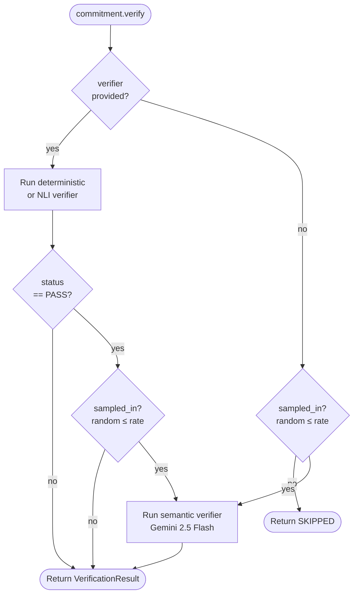

Key behaviors:
- Deterministic verifier runs first — fast, no LLM cost
- Semantic verifier only runs if deterministic passed AND `sampled_in` is true
- If `verifier=None` (semantic-only commitment), sampling alone determines whether semantic runs
- `sampled_in = random.random() <= semantic_sampling_rate`

### 3.5 Verifiers

#### DeterministicVerifier (`pact/verifiers/deterministic.py`)

Callable class that inspects `execution.tool_calls` without an LLM. Configured with:

| Parameter | Type | Effect |
|---|---|---|
| `required_sequence` | `list[tuple[str, str]]` | Each `(before, after)` pair: `before` must appear at a lower index than `after` |
| `max_occurrences` | `dict[str, int]` | Each tool must not appear more than N times |
| `forbidden_tools` | `list[str]` | Listed tools must not appear at all |

**Coverage:** Only tool call indices whose `tool_name` is referenced in the verifier's own configuration are added to `cover`. This ensures coverage only reflects what the commitment actually governs.

```python
relevant: set[str] = set()
for before, after in self.required_sequence:
    relevant.add(before)
    relevant.add(after)
relevant.update(self.max_occurrences.keys())
relevant.update(self.forbidden_tools)
cover = [i for i, name in enumerate(tool_names) if name in relevant]
```

#### SemanticVerifier (`pact/verifiers/semantic.py`)

An async Google ADK `Agent` (Gemini 2.5 Flash) called from a new event loop in a `ThreadPoolExecutor` to avoid conflicts with the outer async context. Given `execution.format()` and the commitment's `terms`, it calls `report_verification_result` with `status`, `actual`, `expected`, and `reasoning`. The `cover` field is not exposed to the LLM — semantic verifiers always return `cover=[]`. Retries up to 3 times with exponential backoff (tenacity).

#### NLI Verifier (`pact/verifiers/nli.py`)

Uses `facebook/bart-large-mnli` via HuggingFace `transformers` zero-shot classification. Compares `execution.format()` against `"complies with: {terms}"` vs `"violates: {terms}"`. Returns `SKIPPED` with `cover=[]` immediately if `transformers` is not installed.

### 3.6 Coverage Computation

After all commitments are verified, `Contract._verify()` computes coverage:

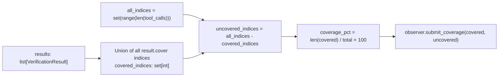

For the OpsGuard 5-commitment contract on a happy-path run with tools `[get_service_metrics[0], get_recent_deployments[1], get_correlated_alerts[2], check_downstream_dependencies[3], log_action[4], restart_service[5]]`:

| Commitment | Verifier | Covered indices |
|---|---|---|
| `dependency_check_before_action` | Deterministic | 3, 5 |
| `remediation_scope_limit` | Deterministic | 5 |
| `audit_trail_commitment` | Deterministic | 4, 5 |
| `false_positive_validation` | Semantic | [] |
| `human_escalation_on_uncertainty` | NLI (skipped) | [] |

Union = `{3, 4, 5}` → **50% coverage**. Uncovered: `{0, 1, 2}` → the three sensor tools no commitment currently governs.

### 3.7 Observer Interface

`pact/observers/base.py` — abstract base class:

```python
class Observer(ABC):
    def capture_span(self) -> None: ...
    def submit_evaluation(self, label: str, value: str, reasoning: str) -> None: ...
    def submit_coverage(self, covered: list[ToolCall], uncovered: list[ToolCall]) -> None: ...
```

`submit_coverage` is called once per `_verify()` call. `submit_evaluation` is called once per `Commitment.verify()` if an observer is passed. `capture_span` is a no-op in the Splunk implementation.

---

## 4. Splunk Observer

`pact/observers/splunk_observer.py`

### 4.1 HEC Transport

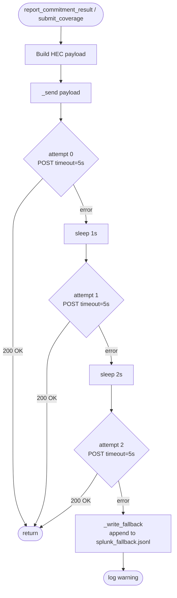

Two reporting methods write to different sourcetypes:

**`report_commitment_result()`** → `pact:commitment` — one event per non-skipped commitment per execution:

```json
{
  "commitment_name": "dependency_check_before_action",
  "passed": false,
  "execution_id": "exec-1718432100",
  "agent_id": "opsguard",
  "verifier_type": "deterministic",
  "contract_name": "opsguard_v1",
  "violation_detail": "'restart_service' called without prior 'check_downstream_dependencies'",
  "tool_call_sequence": ["get_service_metrics", "log_action", "restart_service"],
  "investigation_spl": "index=opsguard sourcetype=\"pact:commitment\" ..."
}
```

**`submit_coverage()`** → `pact:coverage` — one event per execution:

```json
{
  "event_type": "contract_coverage",
  "coverage_percentage": 50.0,
  "uncovered_tool_calls": ["get_service_metrics", "get_recent_deployments", "get_correlated_alerts"],
  "agent_id": "pact_opsguard",
  "contract_name": "opsguard"
}
```

### 4.2 SPL Auto-Generation

`_generate_spl()` produces investigation queries tailored to the verifier type:

| Verifier | SPL pattern |
|---|---|
| `deterministic` | Filter by `commitment_name` + `agent_id`, `mvjoin` the tool sequence, `table` with violation detail |
| `semantic` | `stats count by agent_id, violation_detail` to surface recurring patterns |
| `nli` | `head 20` recent events ordered by time |
| (default) | Generic `head 50` with all key fields |

Queries are generated at violation time with `commitment_name` and `agent_id` already interpolated — paste into Splunk Search and run immediately.

### 4.3 MCP Tools

`splunk/mcp_tools.py` defines 5 MCP tool specifications served via `GET /mcp/tools`:

| Tool | SPL pattern |
|---|---|
| `get_commitment_pass_rates` | `stats` pass/fail counts by commitment, computes `pass_rate` |
| `get_recent_violations` | Filters `passed="false"`, returns last N with investigation SPL |
| `get_contract_coverage` | Latest `pact:coverage` event with `coverage_percentage` |
| `get_violation_investigation_spl` | Looks up auto-generated SPL for a specific `execution_id` |
| `get_violation_timeline` | `timechart` violations by commitment name |

---

## 5. OpsGuard Agent

### 5.1 Agent Setup

`opsguard/agent.py` — `run_incident(alert, force_violation)` is the main entrypoint.

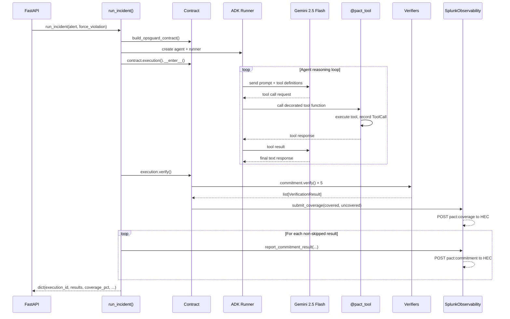

### 5.2 Tool Classification

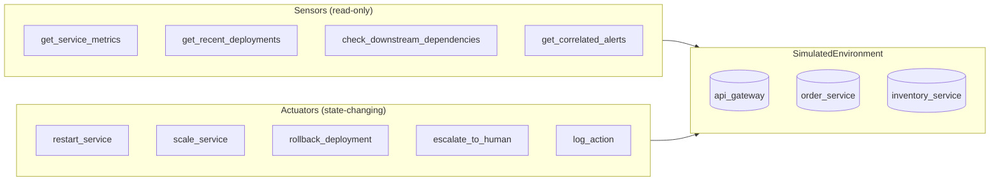

All 9 tools are decorated with `@pact_tool`, making them automatically traced when called within an active `Execution` context.

### 5.3 Simulated Environment

`opsguard/simulator.py` — `SimulatedEnvironment` is a global state machine (all `@classmethod`) controlled by `set_scenario()`.

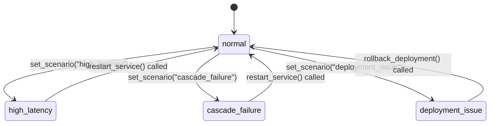

| Mode | Effect |
|---|---|
| `normal` | Healthy metrics across all three services |
| `high_latency` | `order_service` p99=8500ms, error_rate=12% |
| `cascade_failure` | `inventory_service` error_rate=45%, `order_service` error_rate=22%, correlated alerts present |
| `deployment_issue` | `api_gateway` error_rate=8%, deployment `v2.4.1` found 23 minutes ago |

### 5.4 Scenario System

`opsguard/scenarios.py` maps scenario name → configuration. `force_violation: "skip_dependency_check"` switches to `use_bad_prompt=True`, which uses `BAD_SYSTEM_PROMPT` and removes `check_downstream_dependencies` from the ADK tool list entirely. The contract still expects it before `restart_service`, so the violation fires deterministically regardless of Gemini's behavior.

---

## 6. FastAPI Backend

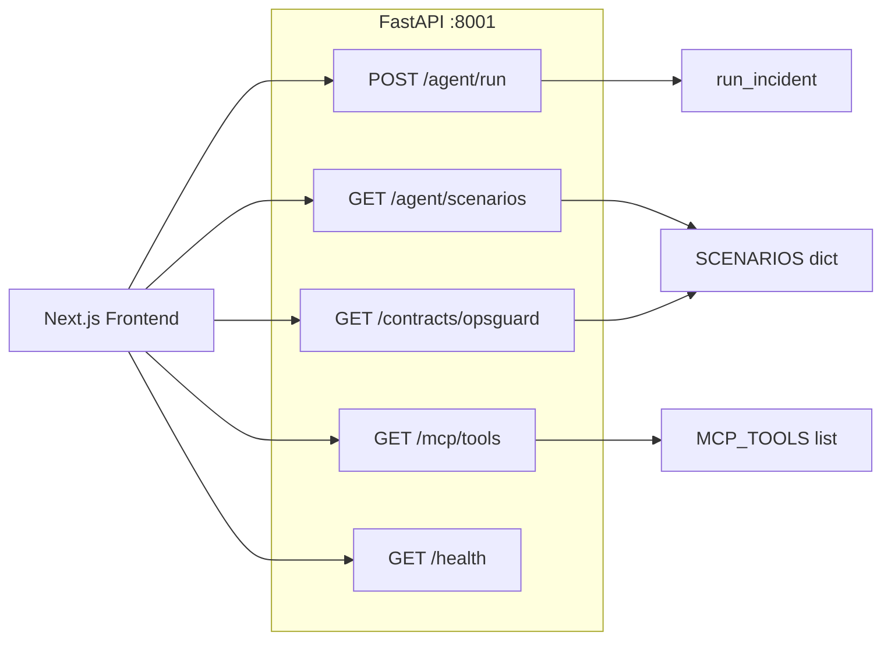

The API loads environment variables from `frontend/.env.local` at startup via `load_dotenv`, so a single env file serves both frontend and backend.

---

## 7. Next.js Frontend

### UI State Machine

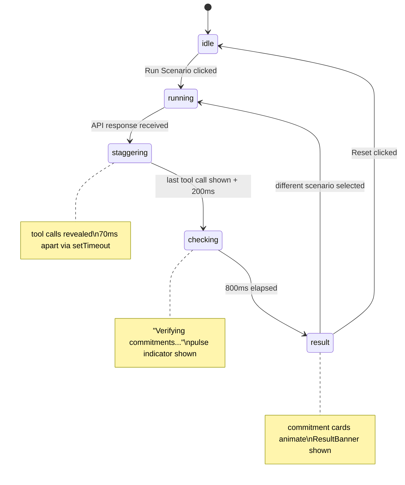

The staggered tool feed is purely cosmetic — all data arrives in a single API response. The 800ms checking state makes the verification phase legible to a viewer.

### Components

| Component | Purpose |
|---|---|
| `ContractPanel` | One card per commitment. During `checking`, all cards pulse blue. After result, cards transition to final status color with 120ms stagger. |
| `ViolationAlert` | Red pulsing glow card. SPL hidden by default with show/hide toggle. "Open in Splunk" button deep-links to Splunk search. |
| `CoverageChart` | Circular gauge showing `coverage_pct`. Lists uncovered tool calls below. |
| `ResultBanner` | Three states: green (all pass), yellow (some skipped), red (violation + "Investigate in Splunk" button). |

---

## 8. Data Flow — Happy Path

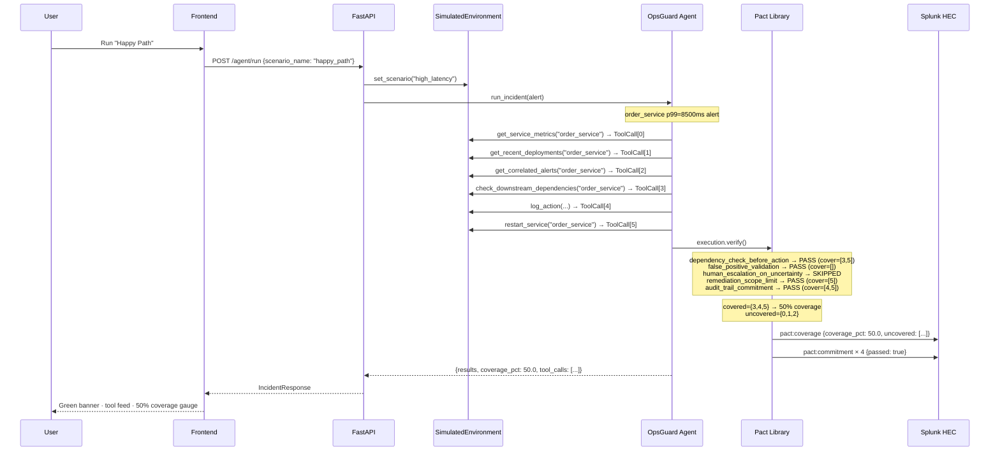

---

## 9. Data Flow — Violation Demo

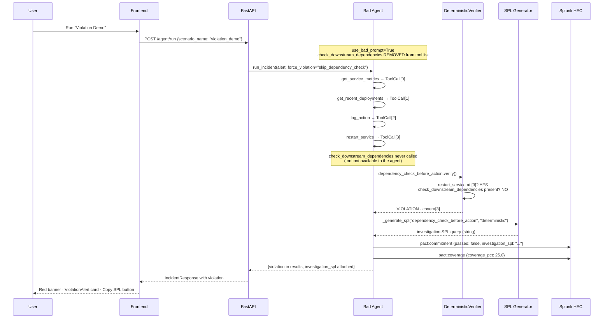

---

## 10. Type System

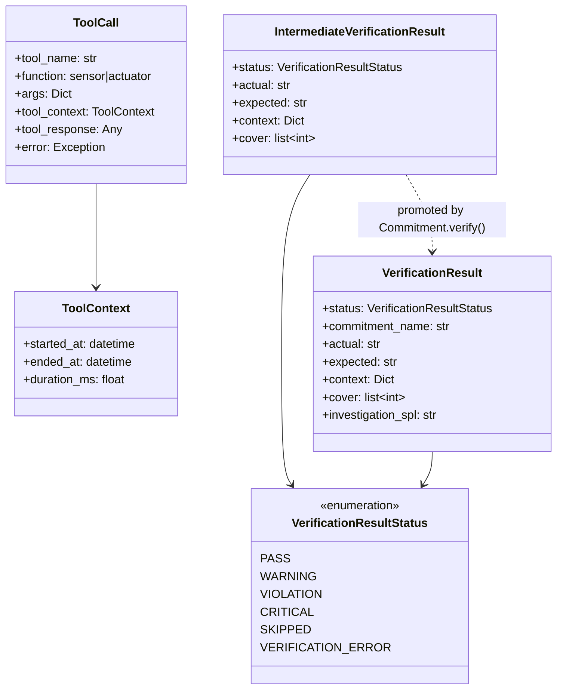

---

## 11. Key Design Decisions

**ContextVar for tool tracing, not monkey-patching.** Tool recording is opt-in via decoration and scoped to a single execution via a `ContextVar`. Multiple concurrent executions in different async tasks do not interfere with each other.

**Two decorator patterns for different scopes.** `@contract.sensor` / `@contract.actuator` work when the contract instance is in scope. `@pact_tool` works when tools are defined globally before any contract exists (the OpsGuard pattern — tools in `tools.py`, contracts in `contract.py`). Both resolve the active execution via the same `ContextVar`.

**Semantic verifier gets `cover=[]`, not LLM-decided indices.** Earlier versions let Gemini report which tool call indices it "checked." Gemini would claim all indices (it reads the full execution to judge intent), inflating coverage to 100%. Coverage is now only attributed to deterministic verifiers that can precisely declare which tools they govern.

**Single `execution.verify()` call.** Previously `verify()` was called in an `after_agent_callback` (which sent a premature Splunk event) and again in `run_incident()` (which sent a second event). Consolidating to one call ensures exactly one `pact:coverage` event per run.

**Skipped commitments are not sent to Splunk.** NLI is optional; if `transformers` is not installed, the result is `SKIPPED`. Sending it as `passed=true` would inflate pass rates. Skipped results are silently dropped from the HEC send loop.

**Violation demo uses a structurally broken agent, not a prompt trick.** Removing the tool from the ADK tool list guarantees the contract fires on every run regardless of Gemini's behavior. A prompt that says "don't check dependencies" could be overridden by a sufficiently capable model; an absent tool cannot be called.

**SPL is generated at violation time, not at query time.** The investigation query is embedded in the HEC event itself. It is available in Splunk immediately, visible in the dashboard's Recent Violations table, and surfaced in the frontend as a copy-pasteable string.
